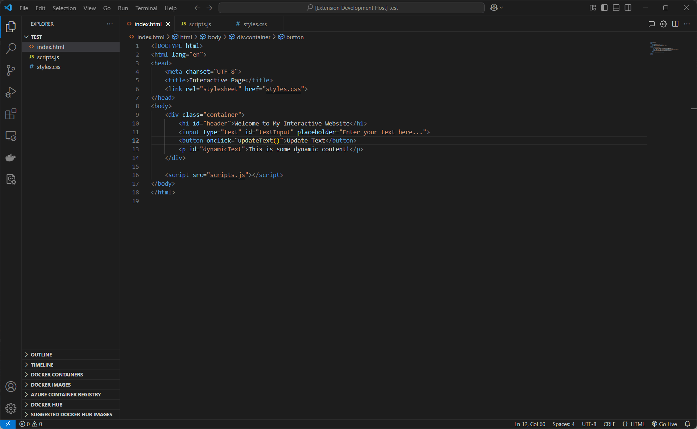

# 🤖 AI Code Commenter

A powerful VSCode extension that uses AI to automatically add intelligent comments to your code. Supports both OpenAI and Ollama as AI providers.

## ✨ Features

### 🎯 Core Features
- **Multi-AI Support**: 
  - 🌐 OpenAI (Any model)
  - 🚀 Ollama (Any model)
- **Multi-Language Comments**:
  - 🇺🇸 English
  - 🇨🇳 简体中文
  - 🇹🇼 繁體中文
- **Real-time Streaming**: Watch comments appear in real-time
- **Visual Feedback**: New comments are highlighted in green
- **Non-destructive**: Creates a new file for commented code

### 🛠️ Advanced Features
- **Customizable AI Settings**:
  - Choose between OpenAI and Ollama
  - Configure API endpoints
  - Select AI models
  - Customize prompt templates
- **Clean Mode**: Option to show only code and comments without additional information
- **Smart Comment Styles**: Automatically uses appropriate comment syntax for different languages

## 📋 Requirements

### For OpenAI
- OpenAI API key
- Internet connection

### For Ollama
- Local Ollama installation
- Compatible AI model (e.g., CodeLlama)

## ⚙️ Configuration

This extension provides the following settings:

| Setting | Description | Default |
|---------|-------------|---------|
| `mouse-commenter.aiType` | AI provider (openai/ollama) | `ollama` |
| `mouse-commenter.apiKey` | OpenAI API key | `""` |
| `mouse-commenter.endpoint` | Ollama API endpoint | `http://localhost:11434/api/generate` |
| `mouse-commenter.model` | AI model to use | Depends on provider |
| `mouse-commenter.baseUrl` | OpenAI API base URL | `https://api.openai.com/v1` |
| `mouse-commenter.onlyCodeAndComments` | Clean mode without extra info | `false` |

## 🚀 Quick Start

1. Install the extension from VS Code marketplace
2. Configure your preferred AI provider:
   - For OpenAI: Set your API key
   - For Ollama: Ensure local server is running
3. Open any code file
4. Click the "Add AI Comments" button in the editor toolbar
5. Select your preferred comment language
6. Watch as AI analyzes and comments your code!

## 🎨 Usage Examples

### Adding Comments
1. Open a code file
2. Click the comment icon in the top-right corner
3. Select language (English/简体中文/繁體中文)
4. Review the generated comments in a new tab

### Configuring AI
1. Click the settings icon in the top-right corner
2. Choose your preferred AI provider
3. Configure the relevant settings
4. Save and start using!

## 🔧 Troubleshooting

Common issues and solutions:

- **OpenAI Not Working**: Check your API key and internet connection
- **Ollama Not Responding**: Ensure Ollama is running locally (`http://localhost:11434`)
- **No Comments Generated**: Verify the selected model supports code analysis

## 📝 Release Notes

See [CHANGELOG.md](CHANGELOG.md) for detailed release notes.

## 🤝 Contributing

Contributions are welcome! Please feel free to submit a Pull Request.

## 📄 License

This project is licensed under the MIT License - see the LICENSE file for details.

## 👨‍💻 Author

yeongpin - [GitHub](https://github.com/yeongpin) 